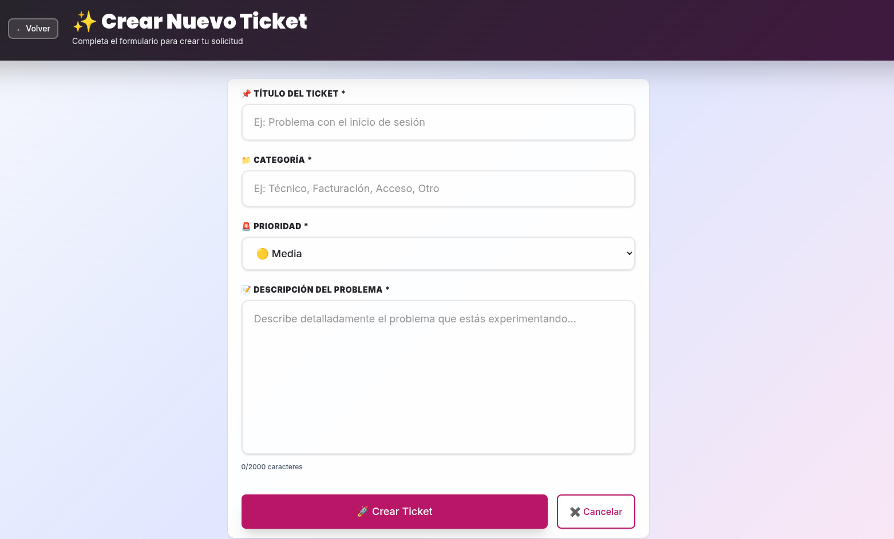
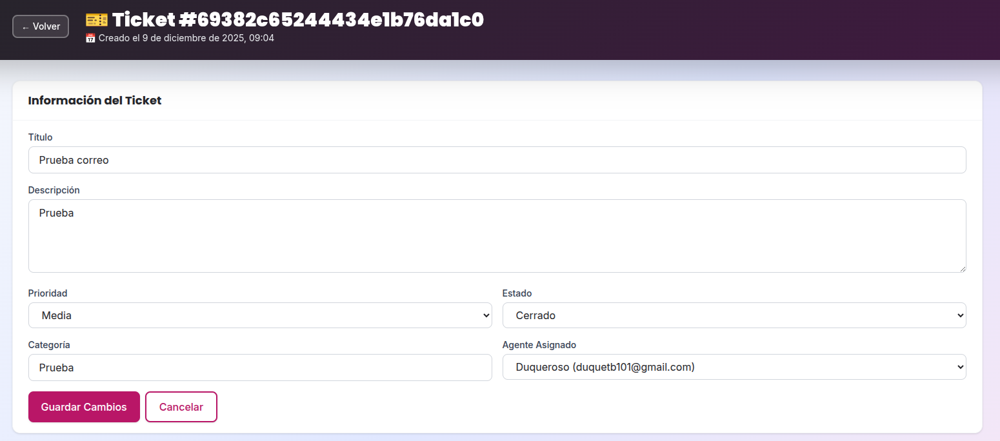
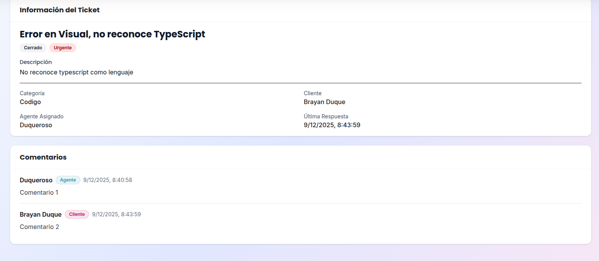
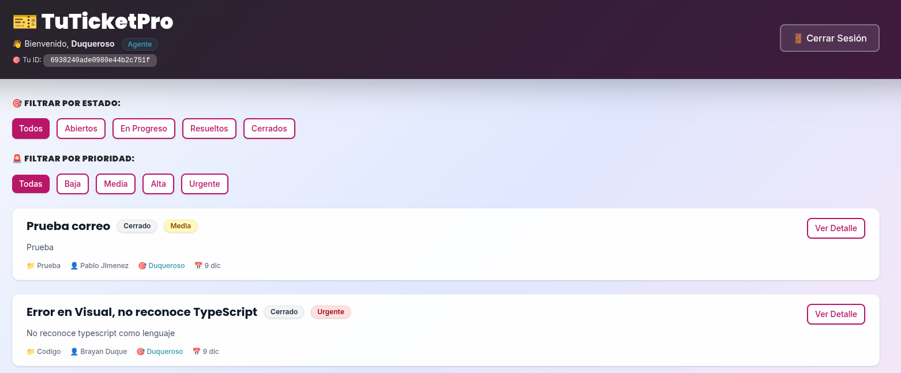

# HelpDeskPro - Sistema de Gestión de Tickets

Sistema completo de gestión de tickets de soporte técnico construido con Next.js, TypeScript, MongoDB y Mongoose.

## 🚀 Características

- ✅ **Autenticación completa** con JWT y roles (Cliente, Agente, Admin)
- ✅ **Gestión de tickets** (CRUD completo)
- ✅ **Sistema de comentarios** en tickets
- ✅ **Notificaciones por email** automáticas
- ✅ **Cron jobs** para recordatorios y encuestas
- ✅ **Vistas diferenciadas** por rol
- ✅ **Componentes reutilizables** tipados
- ✅ **Context API** para estado global
- ✅ **TypeScript** con tipado fuerte

## 📋 Requisitos Previos

- Node.js 18+ 
- MongoDB instalado y corriendo
- Cuenta de email para SMTP (Gmail recomendado)

## 🛠️ Instalación

1. **Clonar el repositorio**
```bash
git clone <repository-url>
cd testfinally
```

2. **Instalar dependencias**
```bash
npm install
```

3. **Configurar variables de entorno**

Copia el archivo de ejemplo y edítalo con tus credenciales:
```bash
cp .env.local.example .env.local
```

Edita `.env.local`:
```env
MONGODB_URI=mongodb://localhost:27017/helpdesk
JWT_SECRET=your-super-secret-jwt-key-change-in-production

# Email Configuration
EMAIL_HOST=smtp.gmail.com
EMAIL_PORT=587
EMAIL_SECURE=false
EMAIL_USER=your-email@gmail.com
EMAIL_PASS=your-app-password
```

**Nota sobre Gmail:** Si usas Gmail, necesitas crear una "contraseña de aplicación":
1. Ve a tu cuenta de Google
2. Seguridad → Verificación en 2 pasos
3. Contraseñas de aplicaciones
4. Genera una nueva contraseña para "Correo"
5. Usa esa contraseña en `EMAIL_PASS`

4. **Iniciar MongoDB**
```bash
# En Linux/Mac
sudo systemctl start mongod

# O si usas Docker
docker run -d -p 27017:27017 --name mongodb mongo
```

5. **Ejecutar en modo desarrollo**
```bash
npm run dev
```

La aplicación estará disponible en `http://localhost:3000`

## 📁 Estructura del Proyecto

```
src/
├── app/                    # Next.js App Router
│   ├── api/               # API Routes
│   │   ├── auth/         # Autenticación (login, register, me)
│   │   └── tickets/      # CRUD de tickets y comentarios
│   ├── dashboard/        # Dashboard principal
│   ├── login/            # Página de login
│   ├── register/         # Página de registro
│   └── layout.tsx        # Layout principal con AuthProvider
├── components/            # Componentes reutilizables
│   ├── Badge.tsx         # Componente Badge tipado
│   ├── Button.tsx        # Componente Button con variantes
│   └── Card.tsx          # Componente Card
├── context/               # Context API
│   └── AuthContext.tsx   # Contexto de autenticación
├── lib/                   # Utilidades
│   ├── auth-middleware.ts # Middleware de autenticación
│   ├── cron.ts           # Cron jobs
│   ├── email.ts          # Servicio de emails
│   ├── jwt.ts            # Utilidades JWT
│   └── mongodb.ts        # Conexión a MongoDB
├── models/                # Modelos de Mongoose
│   ├── Comment.ts
│   ├── Ticket.ts
│   └── User.ts
└── types/                 # Tipos TypeScript
    └── index.ts          # Todas las interfaces y enums
```

## 👥 Roles de Usuario

### Cliente
- Crear tickets
- Ver sus propios tickets
- Comentar en sus tickets
- Actualizar título/descripción de sus tickets

### Agente
- Ver todos los tickets
- Asignarse tickets
- Cambiar estados de tickets
- Responder tickets
- Actualizar prioridad y categoría

### Admin
- Todos los permisos de Agente
- Eliminar tickets
- Ver métricas globales

## 📧 Sistema de Notificaciones

### Emails Automáticos

1. **Creación de ticket** → Email al cliente
2. **Nueva respuesta** → Email al cliente
3. **Ticket cerrado** → Email al cliente
4. **Recordatorios** → Email a agentes (tickets sin respuesta > 24h)
5. **Encuestas** → Email a clientes (tickets cerrados ayer)

## ⏰ Cron Jobs

Los cron jobs se inician automáticamente al ejecutar la aplicación:

1. **Recordatorios** - Cada hora
   - Detecta tickets sin respuesta > 24 horas
   - Envía emails a agentes asignados

2. **Encuestas** - Diariamente a las 10:00 AM
   - Envía encuestas de satisfacción
   - Solo a tickets cerrados el día anterior

3. **Tickets sin asignar** - Cada 2 horas
   - Detecta tickets abiertos sin agente
   - Notifica a todos los agentes

## 🔐 API Endpoints

### Autenticación
- `POST /api/auth/register` - Registrar usuario
- `POST /api/auth/login` - Iniciar sesión
- `GET /api/auth/me` - Obtener usuario actual (requiere token)

### Tickets
- `GET /api/tickets` - Listar tickets (con filtros)
- `POST /api/tickets` - Crear ticket
- `GET /api/tickets/[id]` - Obtener ticket específico
- `PATCH /api/tickets/[id]` - Actualizar ticket
- `DELETE /api/tickets/[id]` - Eliminar ticket (solo admin)

### Comentarios
- `POST /api/tickets/[id]/comments` - Agregar comentario

Todos los endpoints (excepto login y register) requieren token de autenticación:
```
Authorization: Bearer <token>
```

## 🧪 Probar la Aplicación

1. **Crear un usuario cliente**
   - Ir a `/register`
   - Llenar formulario con rol "Cliente"

2. **Crear tickets**
   - Login como cliente
   - Ir a Dashboard
   - Click en "Nuevo Ticket"

3. **Crear un agente**
   - Registrar otro usuario con rol "Agente"

4. **Gestionar tickets**
   - Login como agente
   - Ver todos los tickets
   - Asignar, responder, cambiar estados

## 🛠️ Scripts Disponibles

```bash
# Desarrollo
npm run dev

# Build de producción
npm run build

# Iniciar producción
npm start

# Linting
npm run lint
```

## 🔧 Tecnologías Utilizadas

- **Framework:** Next.js 14+ (App Router)
- **Lenguaje:** TypeScript
- **Base de Datos:** MongoDB con Mongoose
- **Autenticación:** JWT + bcryptjs
- **Emails:** Nodemailer
- **Cron Jobs:** node-cron
- **UI:** Tailwind CSS
- **HTTP Client:** Axios
- **State Management:** Context API

## 📝 Notas Importantes

### Producción

Antes de desplegar a producción:

1. Cambiar `JWT_SECRET` a un valor seguro y aleatorio
2. Configurar un servidor SMTP confiable
3. Habilitar HTTPS
4. Configurar MongoDB Atlas o servidor remoto
5. Revisar configuraciones de CORS si es necesario
6. Implementar rate limiting en las APIs
7. Configurar logs apropiados

### Seguridad

- Las contraseñas se hashean con bcrypt
- Los tokens JWT expiran en 7 días
- Los middlewares validan roles y permisos
- Las rutas protegidas requieren autenticación

## 🐛 Troubleshooting

**Error de conexión a MongoDB:**
- Verifica que MongoDB esté corriendo
- Revisa la URL en `MONGODB_URI`

**Emails no se envían:**
- Verifica las credenciales SMTP
- Si usas Gmail, asegúrate de usar contraseña de aplicación
- Revisa los logs de la consola

**Errores de TypeScript:**
```bash
npm run build
```
para ver errores de compilación

## 📄 Licencia

Este proyecto es parte de una prueba de desempeño educativa.

## 📸 Capturas de Pantalla

### Flujo Principal

#### 1. Creación de Ticket (Cliente)


El cliente puede:
- Crear nuevos tickets con título, categoría, prioridad y descripción
- Todos los campos son obligatorios y validados
- Recibe email de confirmación automáticamente

#### 2. Gestión de Ticket (Agente)


El agente puede:
- Ver todos los tickets del sistema
- Asignar tickets a sí mismo o a otros agentes
- Cambiar el estado (Abierto, En Progreso, Resuelto, Cerrado)
- Modificar la prioridad
- Editar la categoría del ticket

#### 3. Vista de Comentarios


Sistema de comentarios:
- Hilo cronológico de conversaciones
- Identificación de rol (Cliente/Agente/Admin) con badges
- Fecha y hora de cada comentario
- Email automático al cliente cuando un agente responde

### Dashboard


- Filtros por estado y prioridad
- Badges visuales para estado y prioridad
- Vista diferenciada por rol
- Búsqueda y ordenamiento de tickets

## 👨‍💻 Datos del Coder

**Nombre:** Brayan Duque  
**Clan:** Gosling  
**Correo:** duquetb101@gmail.com  
**Documento de Identidad:** 1000207095 
Desarrollado con ❤️ usando Next.js, TypeScript y MongoDB
